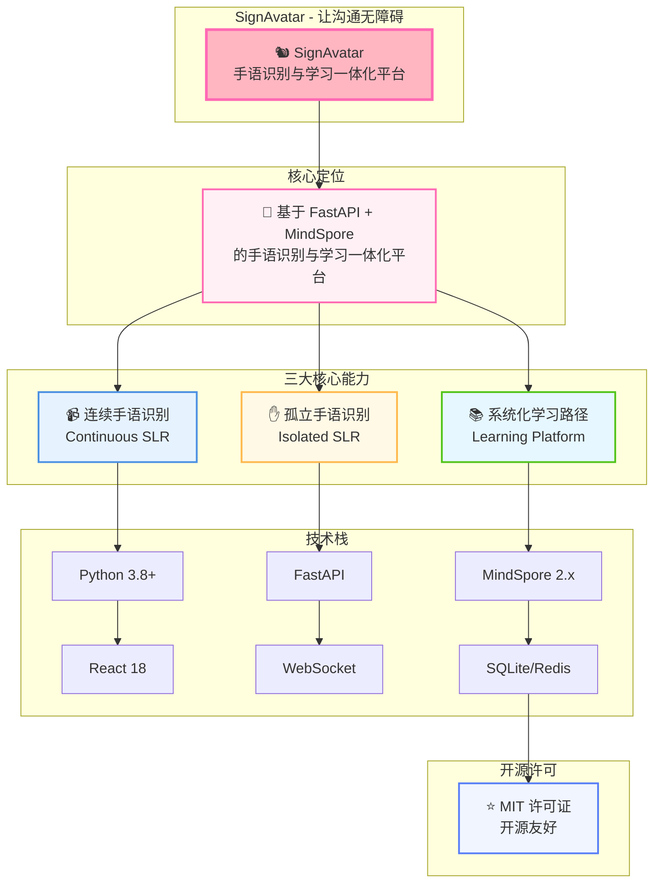
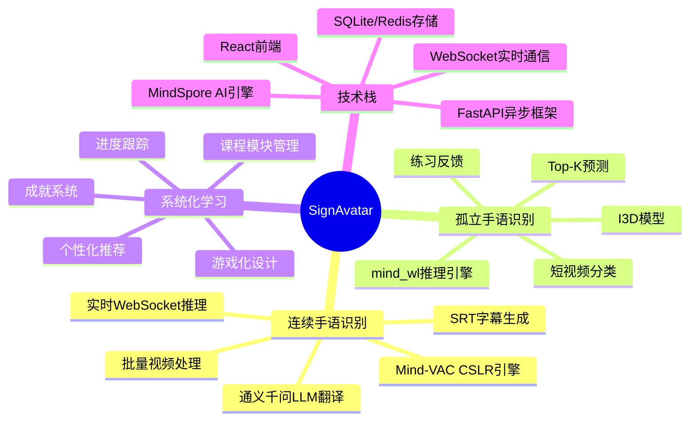
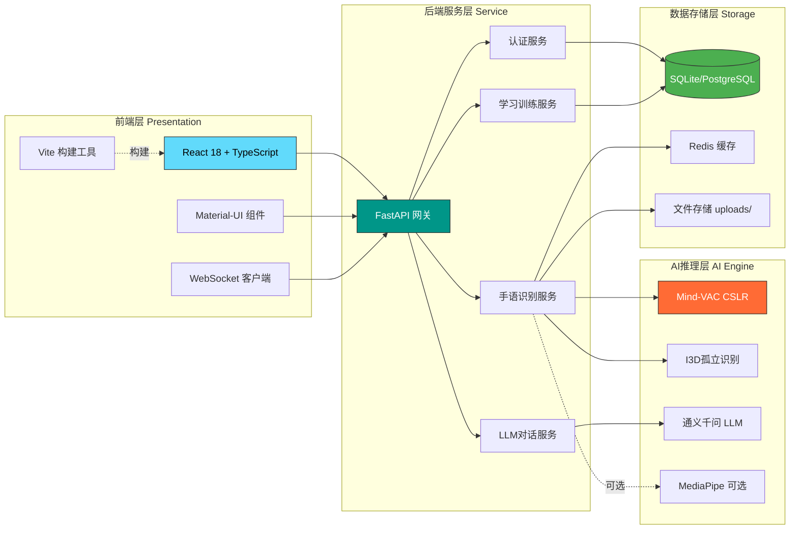
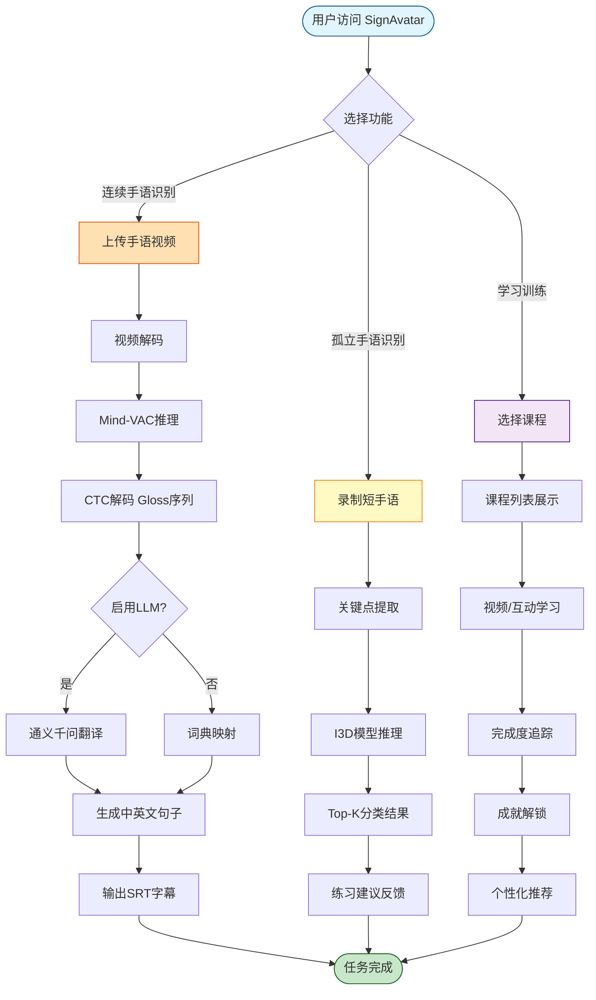
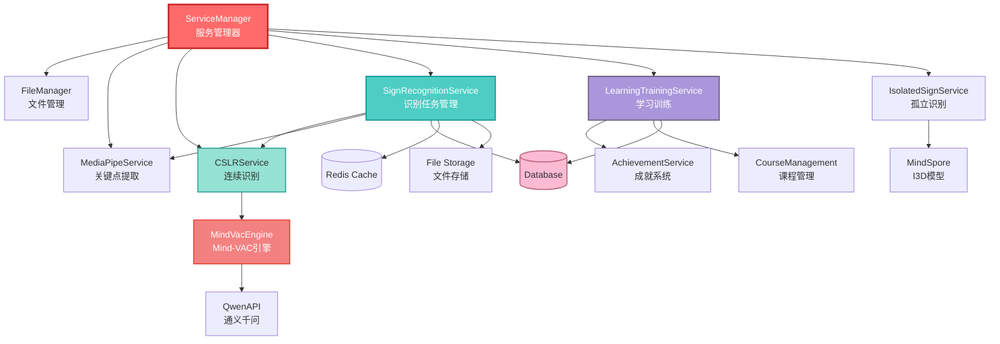
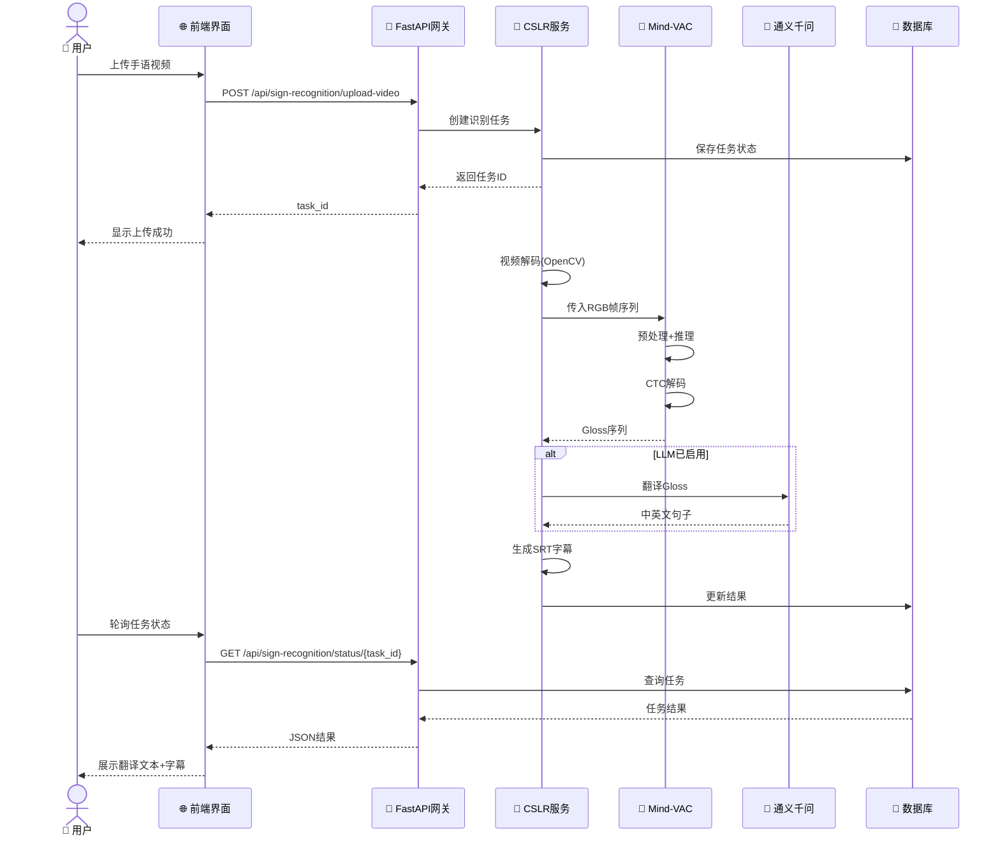
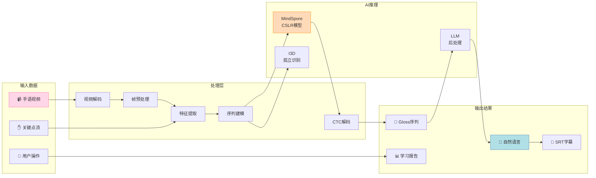
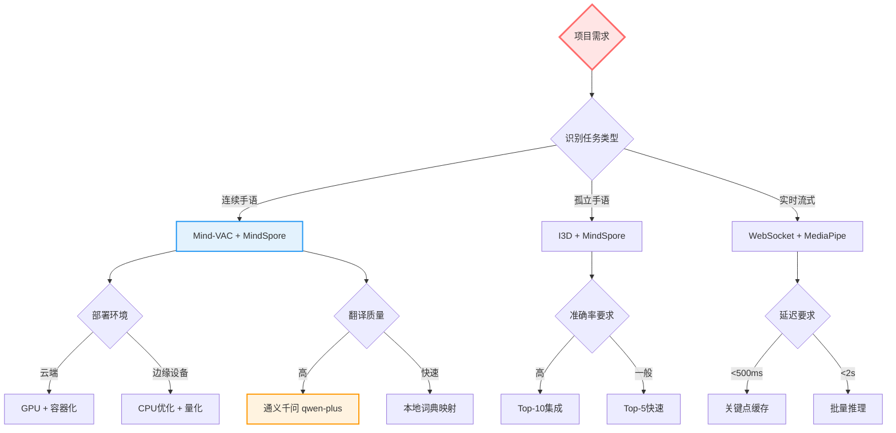
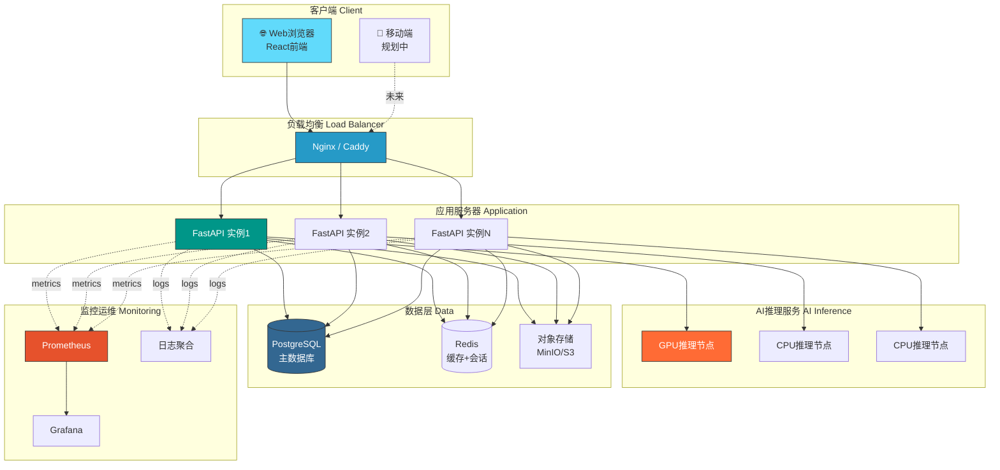

# SignAvatar 系统架构图

## 整体架构概览

## 核心能力展开图

## 技术架构三层图

## 核心能力流程图

## 服务依赖关系图

## 用户交互流程图

## 数据流架构图

## 技术选型决策树

## 部署架构图

---

**说明**: 
- 这些图表展示了 SignAvatar 系统从不同视角的架构设计
- 可以根据具体PPT页面需求选择合适的图表使用
- 所有图表均可在支持 Mermaid 的环境中渲染(如 GitHub、VS Code、Typora等)
