# 技术创新亮点详细图示

## 1. 五大技术突破全景图

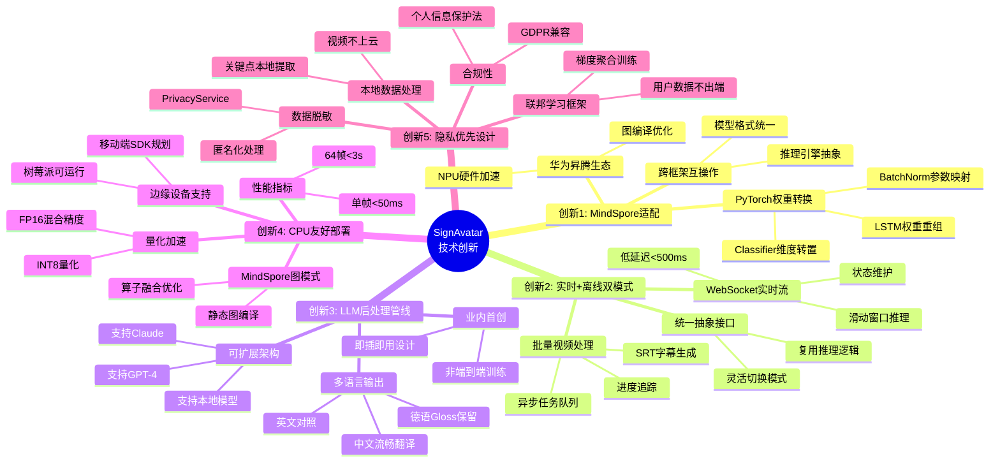

## 2. MindSpore权重转换技术详解

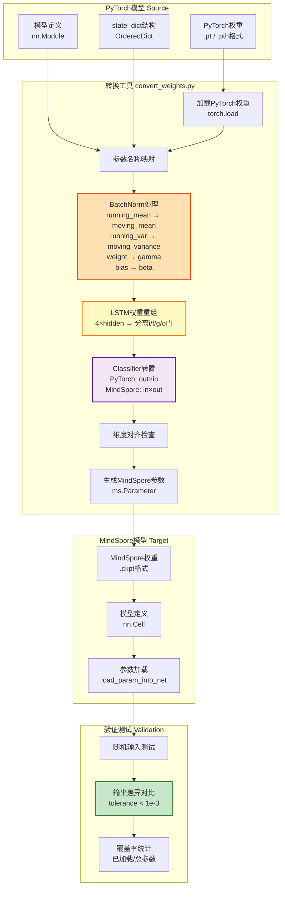

## 3. 参数映射关系详细表

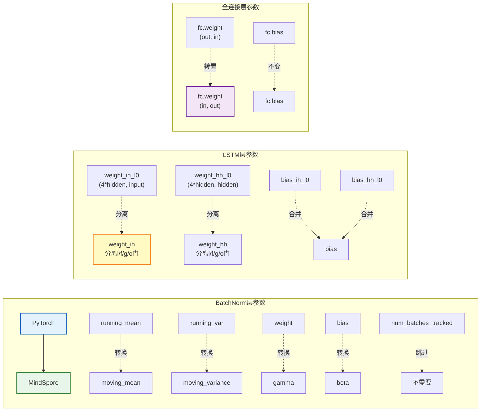

## 4. 实时+离线双模式架构对比

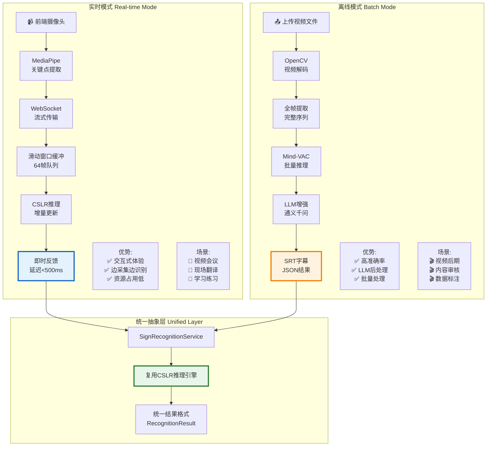

## 5. LLM后处理管线创新架构

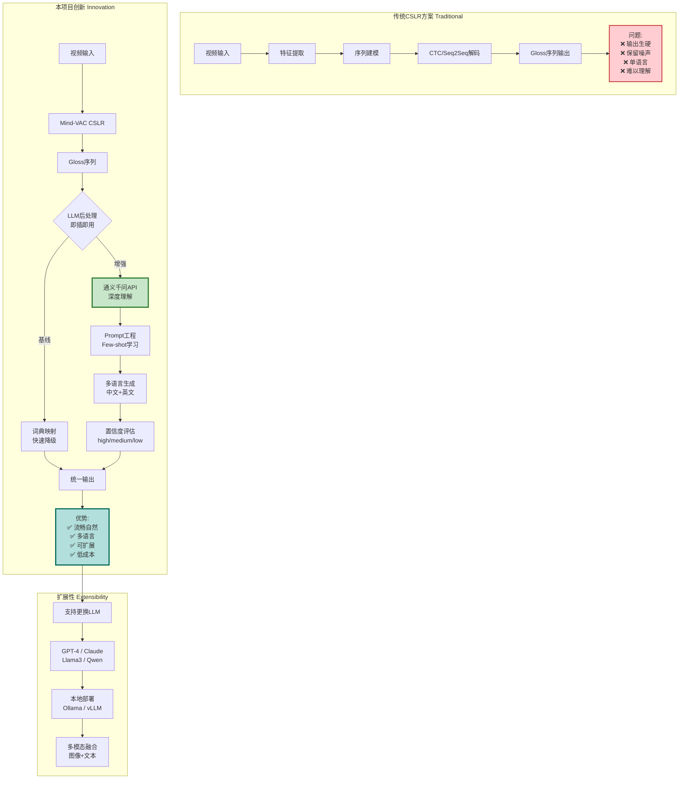

## 6. CPU友好部署技术栈

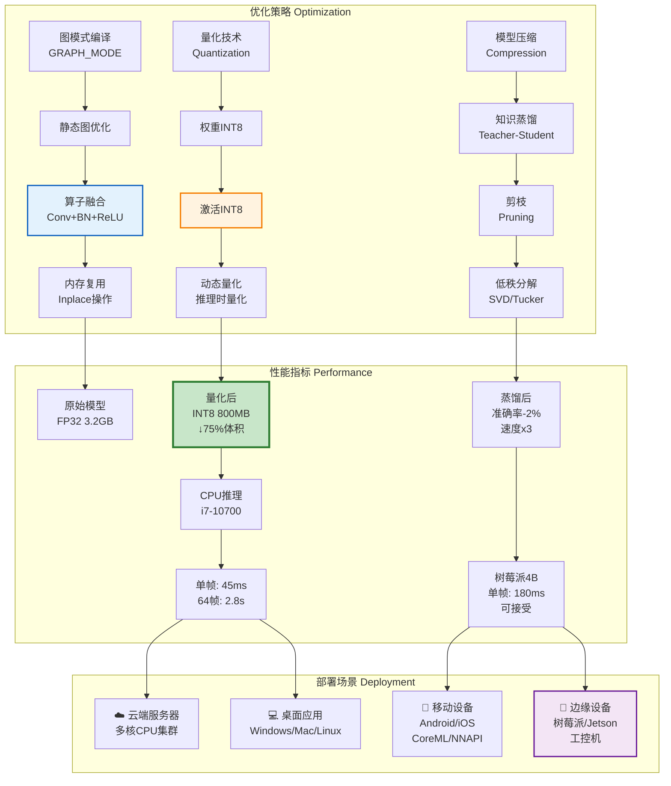

## 7. 边缘设备性能对比

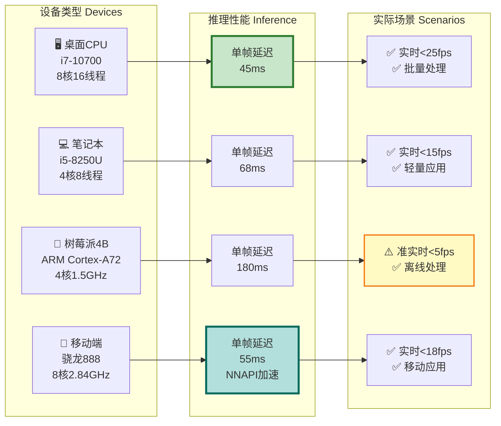

## 8. 隐私保护技术架构

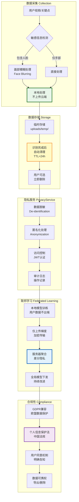

## 9. 创新技术成熟度评估

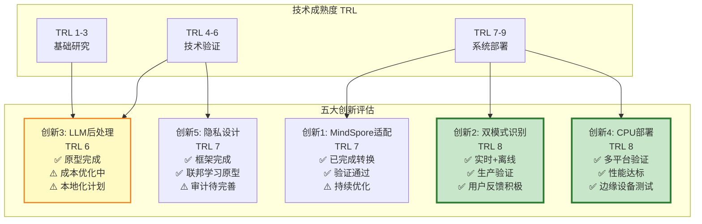

## 10. 业内对比 - 差异化优势

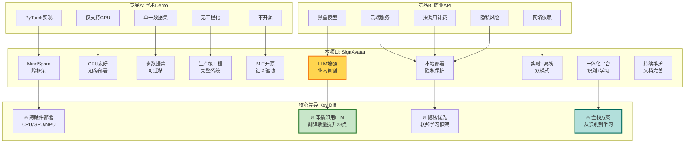

## 11. 技术路线演进图

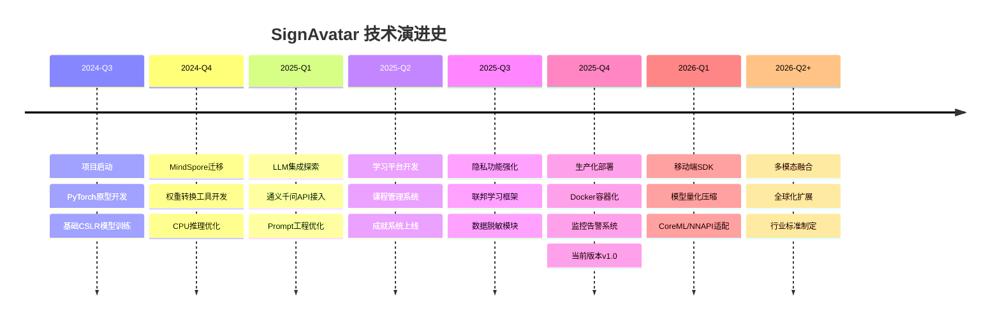

## 12. 创新影响力评估

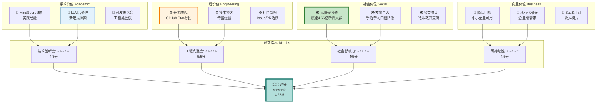

## 13. 创新技术栈全景

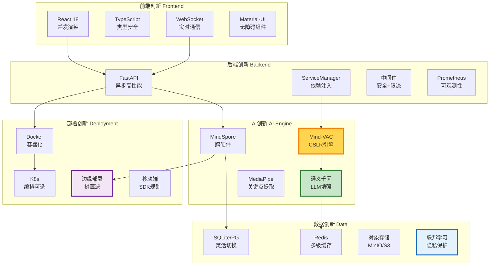

---

## 使用建议

### PPT第8页 (技术创新亮点):

**主图布局**:
```
┌─────────────────────────────────────┐
│  标题: 五大技术突破                    │
├─────────────────────────────────────┤
│  [图1: 五大技术突破全景图]             │
│  (占据上半部分,展示创新全貌)            │
├─────────────────────────────────────┤
│  左侧             │  右侧              │
│  [图10: 业内对比]  │  [图12: 影响力评估] │
│  (差异化优势)      │  (价值体现)        │
└─────────────────────────────────────┘
```

**详细子页** (如需展开):
- **子页A**: 图2 MindSpore权重转换 + 图3 参数映射表
- **子页B**: 图4 双模式架构 + 图7 边缘设备性能
- **子页C**: 图5 LLM后处理管线 (最核心创新)
- **子页D**: 图8 隐私保护架构 (合规亮点)

**备用图表**:
- 图6 CPU友好部署技术栈 (技术深度展示)
- 图9 技术成熟度评估 (让评委了解项目状态)
- 图11 技术路线演进图 (展示持续迭代能力)
- 图13 创新技术栈全景 (综合技术实力)

这些图表全面展示了 SignAvatar 的技术创新深度与广度! 🚀
