# Mind-VAC CSLR 引擎与 LLM 增强详细图示

## 1. Mind-VAC CSLR 完整推理流程图

```mermaid
flowchart TB
    subgraph "输入阶段 Input Stage"
        A1[📹 用户上传视频<br/>Video Upload] --> A2[OpenCV 视频解码<br/>Video Decoding]
        A2 --> A3[帧采样 25fps<br/>Frame Sampling]
        A3 --> A4{帧数检查<br/>Frame Count}
        A4 -->|< 64帧| A5[尾部填充<br/>Tail Padding]
        A4 -->|≥ 64帧| A6[正常处理<br/>Normal Process]
        A5 --> A6
    end
    
    subgraph "预处理阶段 Preprocessing"
        A6 --> B1[CenterCrop 224x224<br/>中心裁剪]
        B1 --> B2[RGB归一化<br/>Normalize to range -1 to 1]
        B2 --> B3[时序对齐<br/>Temporal Alignment]
        B3 --> B4[前后填充<br/>Leading+Trailing Pad]
        B4 --> B5[对齐到4的倍数<br/>Align to Multiple of 4]
        B5 --> B6[转为Tensor<br/>Convert to MindSpore Tensor]
    end
    
    subgraph "Mind-VAC 模型推理 Model Inference"
        B6 --> C1[ResNet18 特征提取<br/>Feature Extraction<br/>输出: T×512]
        C1 --> C2[1D卷积层<br/>Conv1D Temporal<br/>输出: T'×1024]
        C2 --> C3[双向LSTM<br/>Bidirectional LSTM<br/>hidden_size=1024]
        C3 --> C4[全连接分类头<br/>FC Classifier<br/>输出: T'×num_classes]
        C4 --> C5[Softmax归一化<br/>Softmax]
    end
    
    subgraph "CTC解码阶段 CTC Decoding"
        C5 --> D1[Beam Search<br/>束搜索<br/>beam_width=10]
        D1 --> D2[去除Blank标记<br/>Remove CTC Blank]
        D2 --> D3[去除重复<br/>Collapse Repeats]
        D3 --> D4[索引映射词表<br/>Index to Gloss Mapping]
        D4 --> D5[📄 Gloss序列<br/>例: __ON__ LIEB ZUSCHAUER ABEND]
    end
    
    subgraph "后处理阶段 Post-processing"
        D5 --> E1{启用LLM?<br/>LLM Enabled?}
        E1 -->|否 No| E2[词典映射<br/>Dictionary Mapping]
        E1 -->|是 Yes| E3[调用通义千问<br/>Call Qwen API]
        E2 --> E4[基线翻译<br/>Baseline Translation]
        E3 --> E5[LLM增强翻译<br/>Enhanced Translation]
        E4 --> E6[🎬 生成SRT字幕<br/>Generate Subtitles]
        E5 --> E6
        E6 --> E7[💾 保存结果<br/>JSON + TXT + SRT]
    end
    
    E7 --> F1[✅ 返回给用户<br/>Return to User]
    
    style A1 fill:#FFE5E5,stroke:#FF6B6B,stroke-width:3px
    style C3 fill:#E3F2FD,stroke:#2196F3,stroke-width:3px
    style D1 fill:#FFF3E0,stroke:#FF9800,stroke-width:3px
    style E3 fill:#E8F5E9,stroke:#4CAF50,stroke-width:3px
    style F1 fill:#F3E5F5,stroke:#9C27B0,stroke-width:3px
```

## 2. Mind-VAC 模型架构详细图

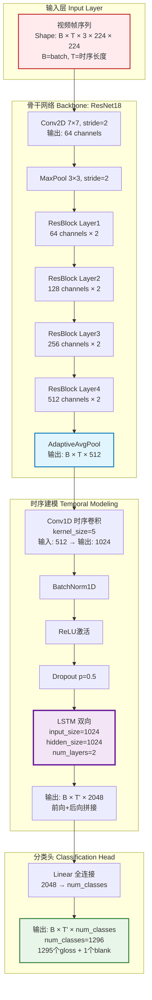

## 3. CTC 解码算法详细流程

```mermaid
flowchart LR
    subgraph "CTC Logits 输入"
        A[模型输出<br/>Shape: T × num_classes<br/>例: 64 × 1296]
    end
    
    subgraph "Beam Search 解码"
        B1[初始化Beam<br/>候选路径队列]
        B2[遍历每个时间步 t]
        B3[对每条路径扩展<br/>Top-k候选]
        B4[计算路径概率<br/>log_prob累加]
        B5[保留Top-B路径<br/>beam_width=10]
        B6{是否到末尾?}
        B6 -->|否| B2
        B6 -->|是| B7[选择最优路径]
    end
    
    subgraph "后处理 Post-process"
        C1[去除CTC Blank<br/>ID=0的标记]
        C2[合并连续重复<br/>例: AAA → A]
        C3[索引转Gloss<br/>ID → 词表映射]
        C4[过滤特殊符号<br/>__ON__, __OFF__等]
    end
    
    subgraph "输出 Output"
        D[Gloss序列<br/>+ 位置信息<br/>+ 置信度]
    end
    
    A --> B1
    B1 --> B2
    B2 --> B3
    B3 --> B4
    B4 --> B5
    B5 --> B6
    B7 --> C1
    C1 --> C2
    C2 --> C3
    C3 --> C4
    C4 --> D
    
    style A fill:#FFF3E0,stroke:#F57C00,stroke-width:2px
    style B5 fill:#E1F5FE,stroke:#0277BD,stroke-width:3px
    style C2 fill:#F3E5F5,stroke:#6A1B9A,stroke-width:2px
    style D fill:#E8F5E9,stroke:#2E7D32,stroke-width:3px
```

## 4. LLM 增强翻译完整流程

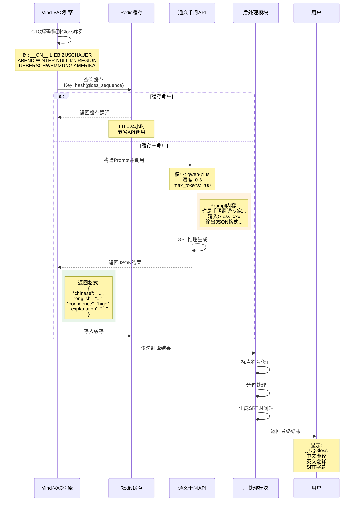

## 5. LLM Prompt 工程详解

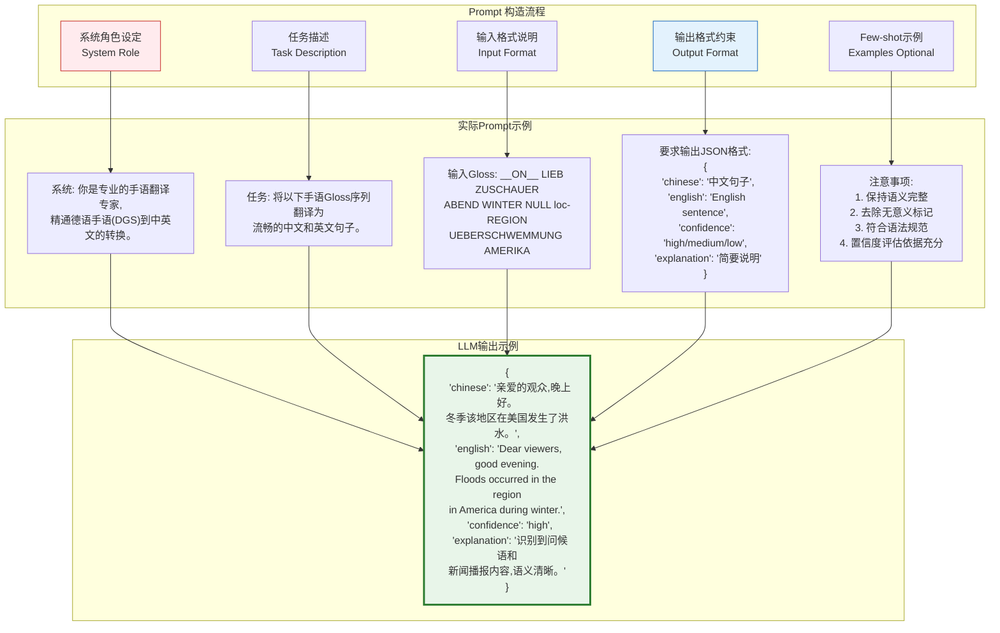

## 6. 通义千问 API 调用架构

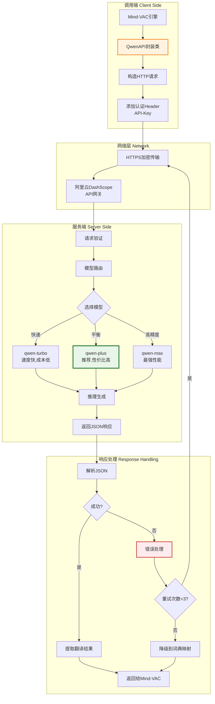

## 7. Gloss 到自然语言的转换对比

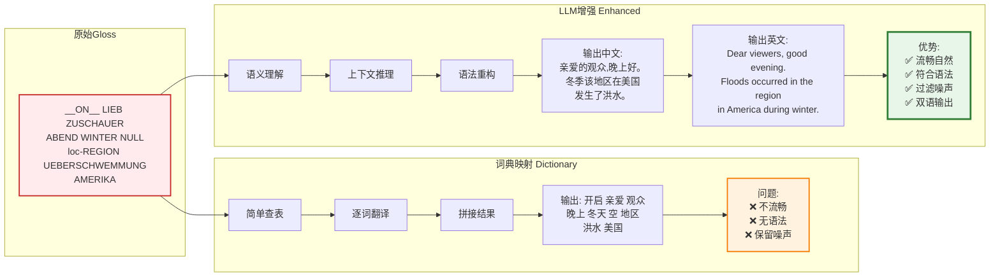

## 8. SRT 字幕生成流程

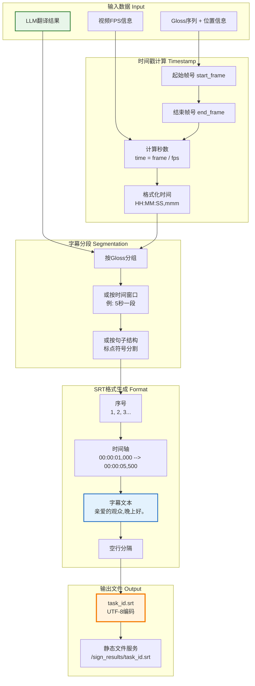

## 9. 实时识别 WebSocket 模式

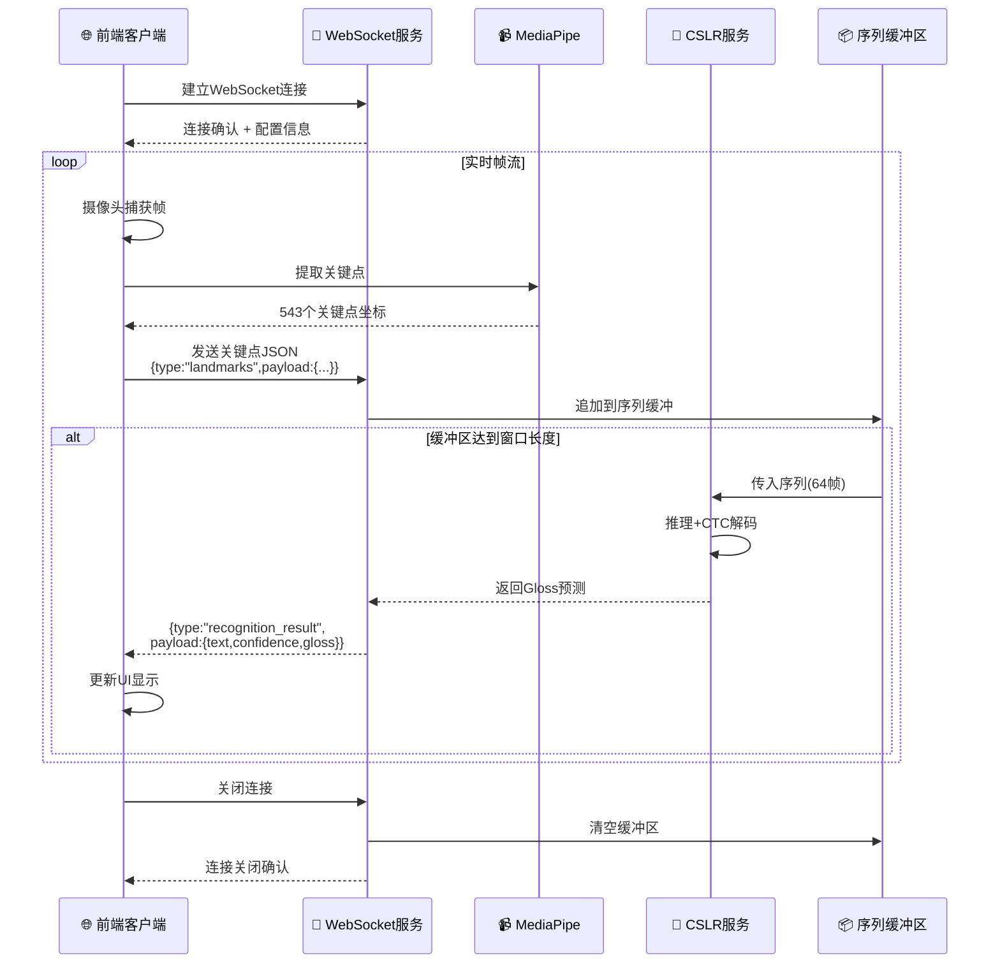

## 10. 性能优化关键点

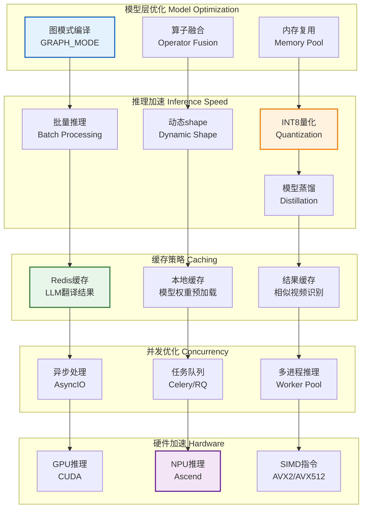

## 11. 错误处理与降级策略

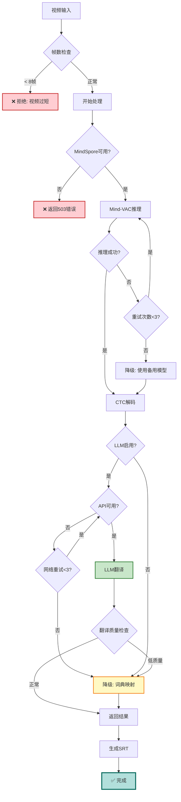

## 12. Mind-VAC vs 传统方法对比

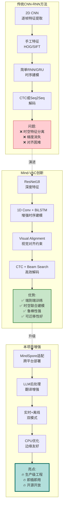

---

## 使用建议

### PPT第5页 (Mind-VAC CSLR引擎):
- **主图**: 图1 完整推理流程图
- **辅助**: 图2 模型架构详细图
- **备选**: 图10 性能优化关键点

### PPT第6页 (LLM增强翻译):
- **主图**: 图4 LLM增强翻译完整流程
- **对比**: 图7 Gloss到自然语言转换对比
- **技术细节**: 图5 Prompt工程详解

### PPT第8页 (技术创新):
- **对比图**: 图12 Mind-VAC vs 传统方法
- **优化图**: 图10 性能优化关键点
- **容错图**: 图11 错误处理与降级策略

这些图表完整展示了 Mind-VAC + LLM 的技术细节和工程实践! 🎨
