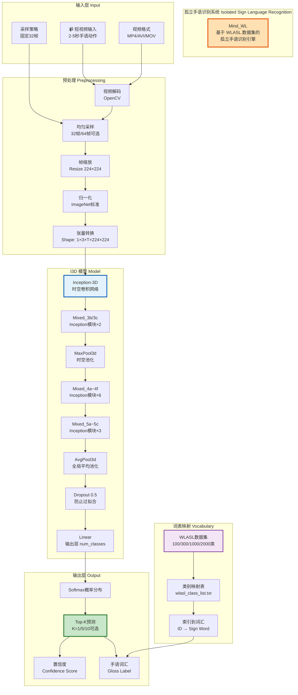
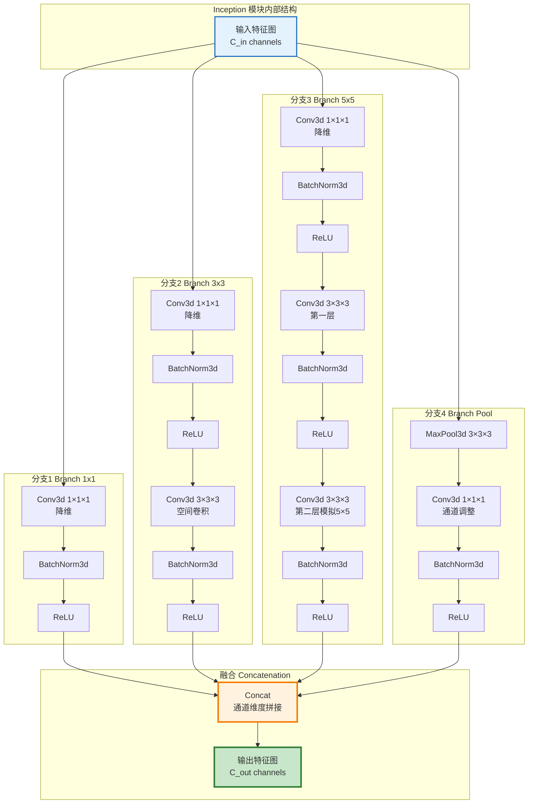
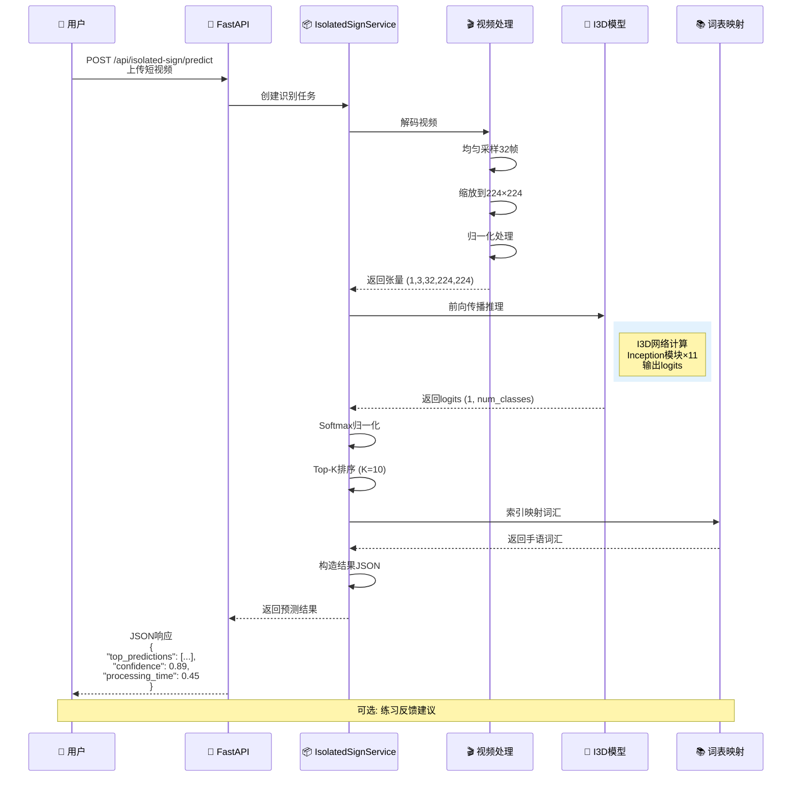
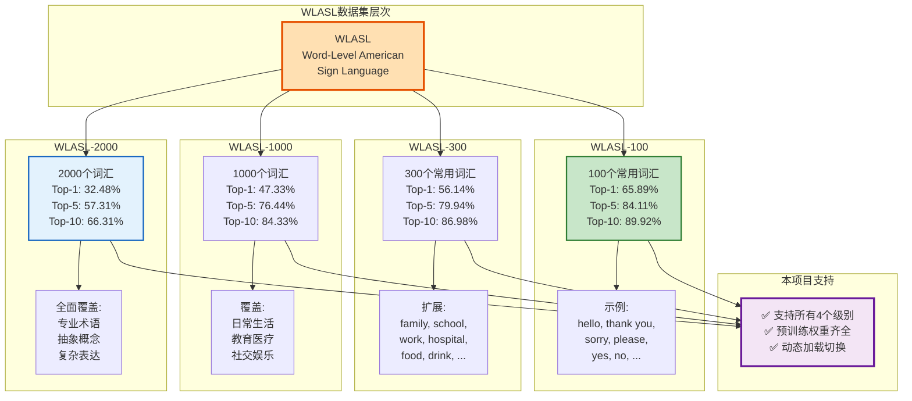
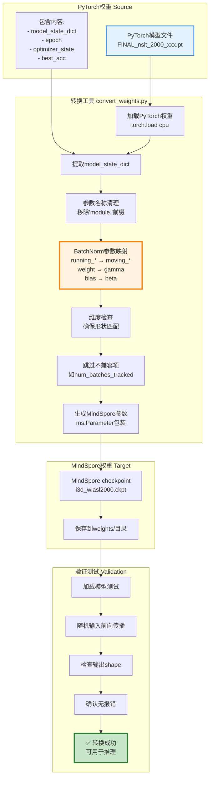
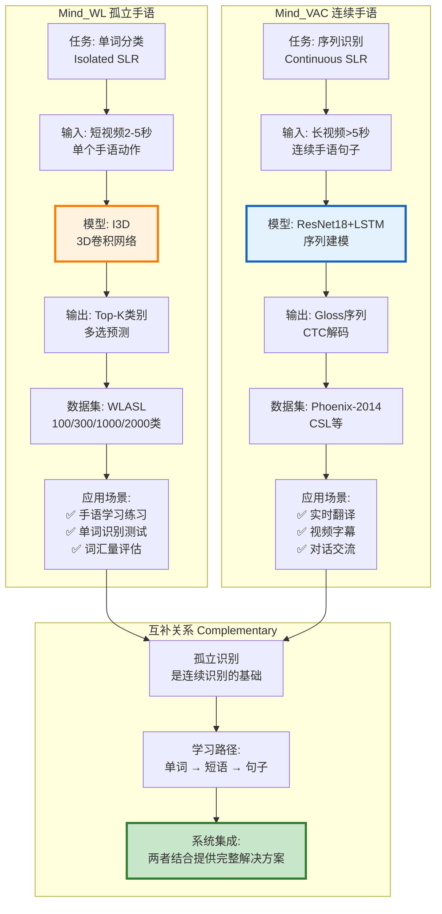
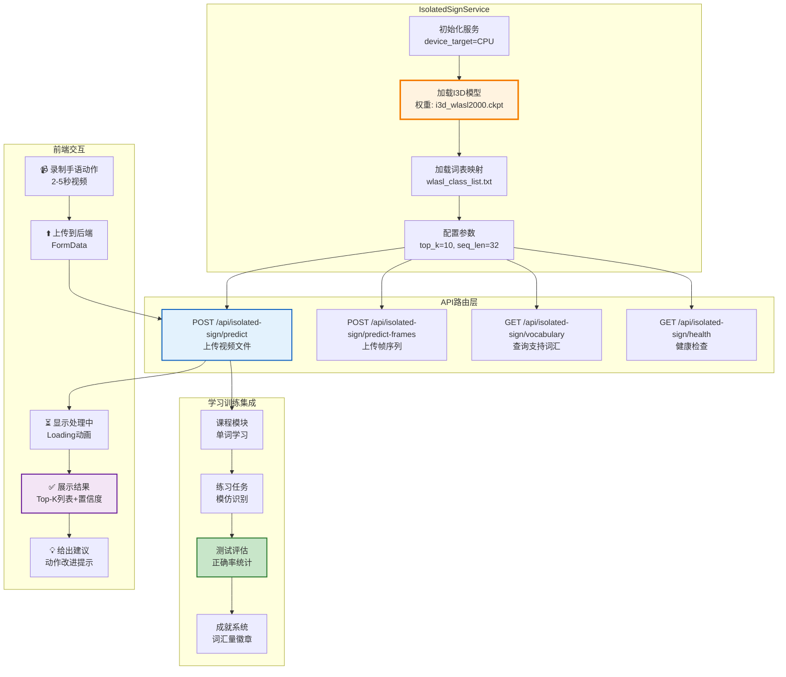
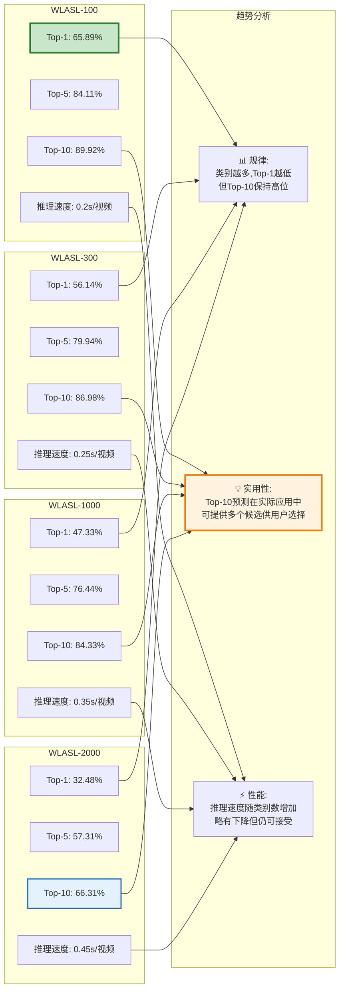
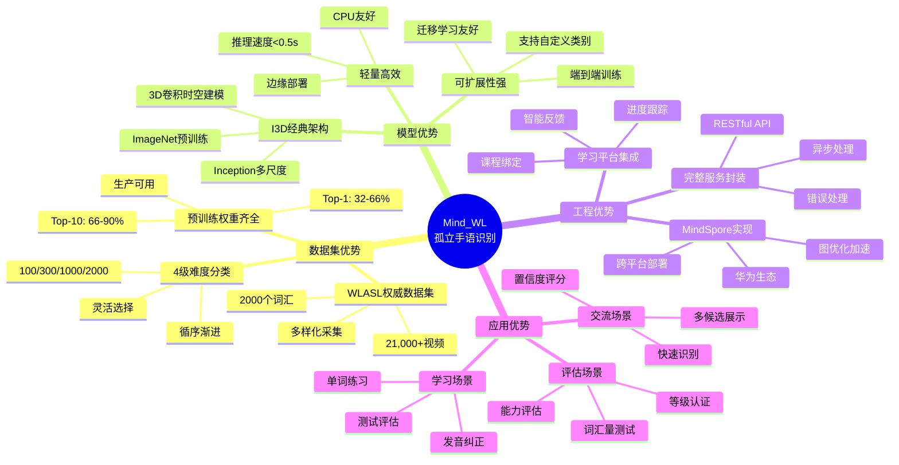

# Mind_WL 孤立手语识别详细图示

## 1. Mind_WL 完整架构图



## 2. I3D 模型架构详细图

```mermaid
graph TB
    subgraph "输入 Input"
        IN[视频张量<br/>Shape: B × 3 × T × H × W<br/>B=1, T=32, H=W=224]
    end
    
    subgraph "Stem 初始层"
        S1[Conv3d_1a_7x7<br/>输出: 64 channels<br/>kernel=(7,7,7),stride=(2,2,2)]
        S2[MaxPool3d_2a_3x3<br/>kernel=(1,3,3), stride=(1,2,2)]
        S3[Conv3d_2b_1x1<br/>输出: 64 channels]
        S4[Conv3d_2c_3x3<br/>输出: 192 channels]
        S5[MaxPool3d_3a_3x3<br/>kernel=(1,3,3), stride=(1,2,2)]
    end
    
    subgraph "Inception Block 1"
        I1[Mixed_3b<br/>Inception模块]
        I2[Mixed_3c<br/>Inception模块]
        I3[MaxPool3d_4a<br/>时空下采样]
    end
    
    subgraph "Inception Block 2"
        I4[Mixed_4a - Mixed_4f<br/>6个Inception模块<br/>逐步增加通道数<br/>256 → 832 channels]
        I5[MaxPool3d_5a<br/>时空下采样]
    end
    
    subgraph "Inception Block 3"
        I6[Mixed_5a - Mixed_5c<br/>3个Inception模块<br/>832 → 1024 channels]
    end
    
    subgraph "分类头 Classifier"
        C1[AvgPool3d<br/>全局平均池化<br/>输出: 1024]
        C2[Dropout 0.5<br/>防止过拟合]
        C3[Linear<br/>1024 → num_classes<br/>100/300/1000/2000]
    end
    
    subgraph "输出 Output"
        OUT[Logits<br/>Shape: B × num_classes]
    end
    
    IN --> S1
    S1 --> S2
    S2 --> S3
    S3 --> S4
    S4 --> S5
    
    S5 --> I1
    I1 --> I2
    I2 --> I3
    
    I3 --> I4
    I4 --> I5
    
    I5 --> I6
    
    I6 --> C1
    C1 --> C2
    C2 --> C3
    
    C3 --> OUT
    
    style IN fill:#FFEBEE,stroke:#C62828,stroke-width:2px
    style I4 fill:#E3F2FD,stroke:#1565C0,stroke-width:3px
    style C1 fill:#FFF3E0,stroke:#F57C00,stroke-width:2px
    style OUT fill:#E8F5E9,stroke:#2E7D32,stroke-width:3px
```

## 3. Inception 模块详细结构



## 4. 完整推理流程图



## 5. WLASL 数据集多级分类体系



## 6. Top-K 预测结果示例

```mermaid
graph LR
    subgraph "输入视频"
        V["手语动作: CLEAR<br/>时长: 2.24秒<br/>67帧"]
    end
    
    subgraph "I3D推理"
        I[模型输出logits<br/>Shape: (1, 2000)]
        S[Softmax归一化<br/>概率分布]
    end
    
    subgraph "Top-10预测结果"
        T1["1. clear - 45.67%<br/>置信度: high"]
        T2["2. clean - 12.34%<br/>置信度: medium"]
        T3["3. bright - 8.90%<br/>置信度: medium"]
        T4["4. white - 5.67%<br/>置信度: low"]
        T5["5. glass - 4.32%<br/>置信度: low"]
        T6["6. window - 3.21%<br/>置信度: low"]
        T7["7. see - 2.89%<br/>置信度: low"]
        T8["8. look - 2.45%<br/>置信度: low"]
        T9["9. watch - 2.01%<br/>置信度: low"]
        T10["10. view - 1.78%<br/>置信度: low"]
    end
    
    subgraph "练习反馈"
        F["建议:<br/>✅ 动作标准,识别准确<br/>✅ 可继续下一词"]
    end
    
    V --> I
    I --> S
    S --> T1
    S --> T2
    S --> T3
    S --> T4
    S --> T5
    S --> T6
    S --> T7
    S --> T8
    S --> T9
    S --> T10
    
    T1 --> F
    
    style V fill:#FFE0B2,stroke:#E65100,stroke-width:2px
    style T1 fill:#C8E6C9,stroke:#2E7D32,stroke-width:3px
    style F fill:#E3F2FD,stroke:#1565C0,stroke-width:2px
```

## 7. PyTorch 权重转换流程



## 8. Mind_WL vs Mind_VAC 对比



## 9. 服务集成架构



## 10. 性能指标对比



## 11. 实际应用场景流程

```mermaid
flowchart TB
    subgraph "场景1: 手语学习练习"
        S1_1[👨‍🎓 学生打开学习模块]
        S1_2[📖 选择目标词汇 HELLO]
        S1_3[🎬 观看示范视频]
        S1_4[📹 自己录制模仿]
        S1_5[⬆️ 上传到Mind_WL识别]
        S1_6{识别结果}
        S1_6 -->|Top-1正确| S1_7[✅ 恭喜,继续下一个]
        S1_6 -->|Top-5包含| S1_8[⚠️ 接近,需改进<br/>显示差异分析]
        S1_6 -->|Top-10包含| S1_9[❌ 动作不准确<br/>重新观看示范]
        S1_6 -->|未在Top-10| S1_10[❌ 严重错误<br/>建议回看基础课程]
    end
    
    subgraph "场景2: 词汇量测试"
        S2_1[📝 开始测试模式]
        S2_2[🎲 系统随机选词]
        S2_3[📹 用户录制手语]
        S2_4[🔍 Mind_WL识别]
        S2_5[📊 统计正确率]
        S2_6[🏆 生成测试报告<br/>- 正确数/总数<br/>- 薄弱词汇<br/>- 等级认证]
    end
    
    subgraph "场景3: 日常交流辅助"
        S3_1[💬 用户想表达某个词]
        S3_2[📹 快速录制手语]
        S3_3[⚡ 实时识别<br/>延迟<0.5s]
        S3_4[📱 手机显示结果<br/>Top-3候选]
        S3_5[👆 用户确认选择]
        S3_6[🔊 语音播报<br/>或文字展示]
    end
    
    S1_1 --> S1_2 --> S1_3 --> S1_4 --> S1_5 --> S1_6
    S2_1 --> S2_2 --> S2_3 --> S2_4 --> S2_5 --> S2_6
    S3_1 --> S3_2 --> S3_3 --> S3_4 --> S3_5 --> S3_6
    
    style S1_7 fill:#C8E6C9,stroke:#2E7D32,stroke-width:2px
    style S2_6 fill:#E3F2FD,stroke:#1565C0,stroke-width:2px
    style S3_3 fill:#FFF3E0,stroke:#F57C00,stroke-width:2px
```



## 12. 技术优势总结



---

## 使用建议

### PPT相关页面使用:

**第4页 (核心技术模块) - Mind_WL子页**:
```
标题: 孤立手语识别 - Mind_WL引擎

主图: 图1 完整架构图
左侧: 图2 I3D模型架构
右侧: 图5 WLASL数据集层次
底部: 图10 性能指标对比
```

**第7页 (学习训练平台) - 练习模块**:
```
标题: 互动练习 - 实时反馈

流程图: 图11 实际应用场景流程
示例: 图6 Top-K预测结果示例
集成: 图9 服务集成架构
```

**第8页 (技术创新) - Mind_WL特色**:
```
对比: 图8 Mind_WL vs Mind_VAC
优势: 图12 技术优势总结
流程: 图7 权重转换流程
```

### 核心亮点总结:

1. **数据集完整**: WLASL 100/300/1000/2000 四级分类,权重齐全
2. **模型成熟**: I3D经典架构,3D卷积时空建模,准确率高
3. **工程完善**: MindSpore实现,服务封装,API完整
4. **应用丰富**: 学习练习、测试评估、日常交流三大场景
5. **互补设计**: 与Mind_VAC连续识别形成完整解决方案

这些图表全面展示了 Mind_WL 孤立手语识别引擎的技术细节与应用价值! 🎯
